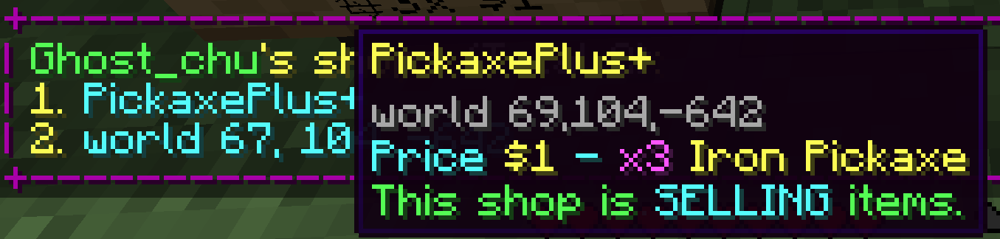
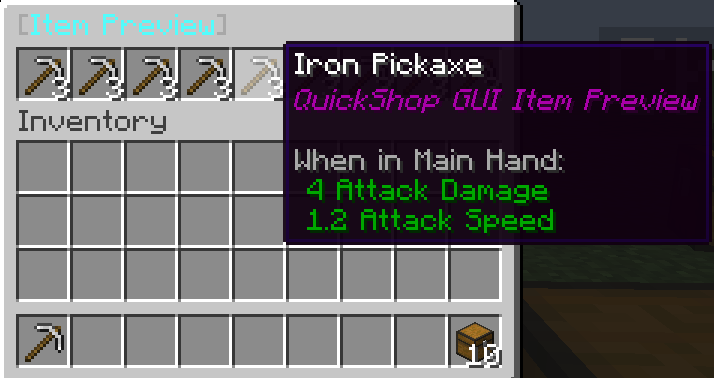

# List Addon

:::info

This addon was added into QuickShop-Hikari at 4.1.0.0-SNAPSHOT

:::

This addon added a command `/qs list` to allow player or server administrator to listing all shops.

## Permissions

* `quickshopaddon.list.self` - The permission to use `/qs list` to query self shops
* `quickshopaddon.list.other` - The permission to use `/qs list <player_name>` to query others shops

## Listing

This addon can listing all shops that owned by specific player, and display in a list with shop name (or location for un-named shops).

## Simple Information

By hover your cursor on a entry, you will able to see the shop name, shop location, shop price, shop item, and shop type.

## Fast Preview

If player are able to preview a shop (e.g click [Preview Shop] in purchase dialog), then player also able to preview the shop remotely by clicking the entry.

