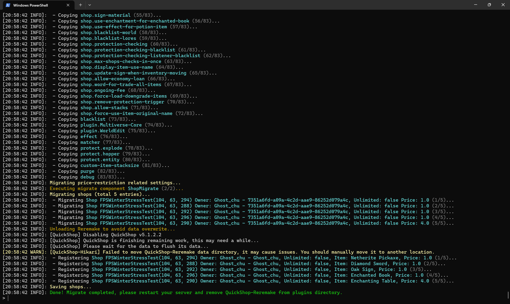

# Reremake Migrator Addon

:::info

Can't find where to download the JAR? [Click here](../faq/where-addons-compacts-at.md).

:::

:::info

This addon was added into QuickShop-Hikari at 5.1.1.0

:::

:::caution

This Addon is still in an experimental stage, so please manage your backup files properly before using it. Use at your own risk.

:::

This addon added a migrator that allow users easily migrate from [QuickShop-Reremake](https://www.spigotmc.org/resources/62575/) to QuickShop-Hikari.




## Step by step tutorial

:::info

Please note that if you are unable to understand the content of this tutorial, please join our Discord channel or ask other professional server owners / operators.

:::

### Backup everything

There are risks involved in performing data conversions, so you'd better create a full backup of all your data including the world, database, and plugin folders in order to restore them in case the conversion fails.

### Configure QuickShop-Hikari

Follow the usual steps to set up QuickShop-Hikari and Addon-Reremake-Migrator, making sure that QuickShop-Hikari,  QuickShop-Reremake Addon-Reremake-Migrator are installed on the server at the sasme time.

Afterwards, configure QuickShop-Hikari's database settings. If QuickShop-Hikari and QuickShop-Reremake are using the same MySQL database, **YOU MUST to set a different table prefix for QuickShop-Hikari, otherwise the data for both will be corrupted and the conversion will fail**. *The path of the table prefix in the configuration file is `database.prefix`.*

*This is not necessary if you are using an H2 database.*

### Prepare for convert

To avoid data corruption, no players (including administrators) are allowed on the server while data conversion is being performed, and all operations will be performed on the console.  
If a player is in the server, the conversion cannot be started.

Once the conversion has begun, the server will be locked during the conversion process and no players will be able to join the server during the conversion.

At the end of the conversion, regardless of whether the conversion was successful or not, the server will be locked and no players will be able to join the server until the server is restarted.

### Begin for convert

Execute the command in the console:

```shell
/quickshop-hikari:quickshop migratefromreremake (overwrite) (migratelogs)
```

> (overwrite): When a Reremake conflicts with a Hikari store during conversion, is the converter allowed to overwrite this conflicting Hikari store with data from the Reremake. It accepts `true` or `false`

> (migratelogs): Should Hikari also migrate the history transactions logs from `qs.log` (and it's compressed archives) to new database? It still in beta, use at your own risks. Currently only support migrate Purchase logs. To convert the transaction logs, please switch to Database storage method in Hikari's config.yml for transaction logging.

> /quickshop-hikari:quickshop: Since QuickShop-Hikari and QuickShop-Reremake are installed at the same time, there will be command contention issues. This command uses namespaces in order to solve the problem of commands being grabbed by Reremake.

The following is a example of this command:

```shell
/quickshop-hikari:quickshop migratefromreremake true false
```

### Converting

Once the command is executed, the conversion begins immediately.
The converter will convert the configuration information for most of the features to QuickShop-Hikari format.

The time it takes to convert depends on the number of stores you have, processor performance, and database performance.

The vast majority of data and configuration will be converted, but transaction logs, interaction-behavior are not supported.
Please check the configuration file again after the conversion to make sure that all configurations are converted as you expected. If not, you may be required to configure it manually.

### Finished

After the conversion is complete, QuickShop-Reremake will be temporarily closed (but not uninstalled) by QuickShop-Hikari.

You need to shut down the server and remove the QuickShop-Reremake and Addon-Reremake-Migrator JAR files.
If all goes well, all your stores will now be taken over by QuickShop-Hikari and will work properly as expected.