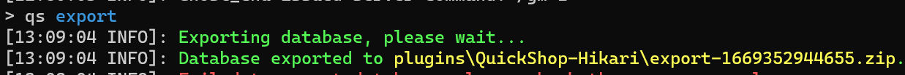

# Databases

QuickShop-Hikari support `H2` and `MySQL` two type of databases.

## Configuration

```yaml
#MySQL database settings.
database:
  #false = use local SQLite database.
  #true = use local/remote MySQL database.
  mysql: false
  # The database address. (Only required if mysql is true)
  host: localhost
  # The database port. (Only required if mysql is true)
  port: 3306
  # The database names. (Only required if mysql is true)
  database: quickshop
  # The database username. (Only required if mysql is true)
  user: root
  # The database password. (Only required if mysql is true)
  password: passwd
  # Set prefix to "none" to remove prefix (Both local and remote will be used).
  prefix: "qs_"
  # Should QuickShop use SSL for database connections?  (Only required if mysql is true)
  usessl: false
  # Properties for creating connections, you can add your own properties for datasource here. (Both local and remote will be used).
  properties:
    connection-timeout: 60000
    validation-timeout: 3000
    idle-timeout: 60000
    login-timeout: 10
    maxLifeTime: 60000
    maximum-pool-size: 8
    minimum-idle: 2
    cachePrepStmts: true
    prepStmtCacheSize: 250
    prepStmtCacheSqlLimit: 2048
    useUnicode: true
    characterEncoding: utf8
```

## Migrate

If you want migrate your quickshop data from one type of database to another type, you can export your data then import them.

Execute the `/qs export` command in console, quickshop will export a zip which include shop datas.



Stop your database, switch the datasource, and start the server.  
You may noticed all shops are gone, because new datasources had no data inside, we will restore them from export.

Rename that exported ZIP file to `recovery.zip`, execute `/qs recovery` and restart your server, all shops should back.
