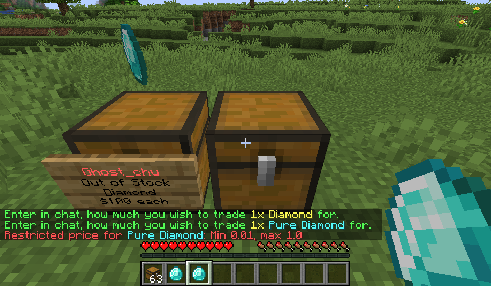

# Item Reference (Item Lookup)

In some situation, only use Material name is not enough.  

## Why

Think about, it's easy to limit a Stone price like this:

```yaml
rules: # Rules set
  cheap-stone: # Rules name, used for identifier and permission node (quickshop.price.restriction.bypass.<name>)
    items: # Items in the rule (https://hub.spigotmc.org/javadocs/spigot/org/bukkit/Material.html), or the reference the item lookup table by adding @ before the name
      - STONE
    currency: # Currency name, If your plugin doesn't support multi-currency (Vault API), this section won't be used
      - '*'
    min: 0.01 # Min price (double)
    max: 1.00 # Max price (double)
```

But if I want limit a Slimefun gadget?

## Create a item reference

Holding the item you want to create a reference for, then execute command `/qs lookup create <name>`.


And you can add `@` prefix at the front of item name to use that reference.

```yaml
rules: # Rules set
  cheap-diamond: # Rules name, used for identifier and permission node (quickshop.price.restriction.bypass.<name>)
    items: # Items in the rule (https://hub.spigotmc.org/javadocs/spigot/org/bukkit/Material.html), or the reference the item lookup table by adding @ before the name
      - "@purediamond"
    currency: # Currency name, If your plugin doesn't support multi-currency (Vault API), this section won't be used
      - '*'
    min: 0.01 # Min price (double)
    max: 1.00 # Max price (double)
```

Now you will only limit the price for item Pure Diamond!

