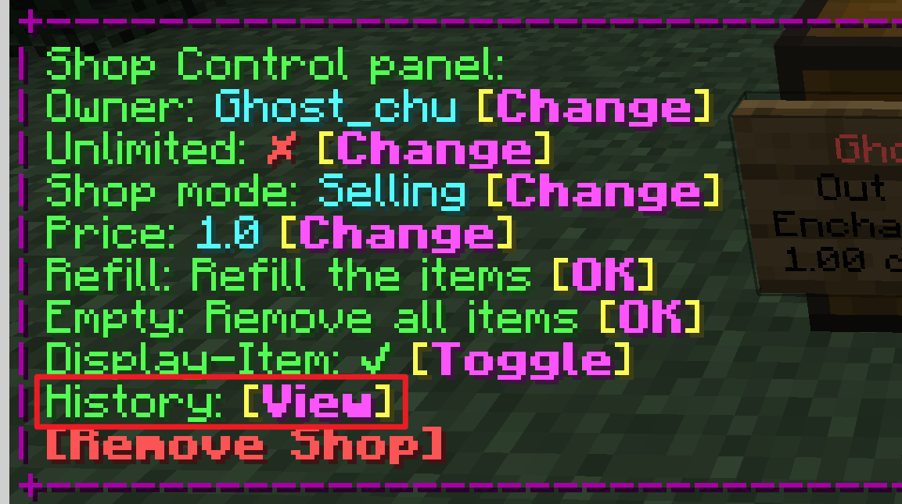

# Shop History

The shop history allows players to check the history of transactions in one or more stores.

## Query specific store transaction history

Open the store control panel and click the view history button.

## Query multiple stores via command

Use command `/quickshop history <sub-commands>`.

Available sub-commands:

* `owned`: Select all shops which you're owner
* `accessible`: Select all shops which you have per-shop permission to access the store history
* `global`: Select all shops on this server (require permission)

## History GUI

The History GUI displays the details of each recorded transaction and other useful information.

### Transaction details

When hovering over a detail item, information such as store name (or coordinates), purchaser, item, amount, tax, etc. will be displayed.  
If you are checking the history of more than one store, the player head will be replaced with an item from the corresponding store.

### Summary

Hover on left-top item, the shop summary will be displayed.

