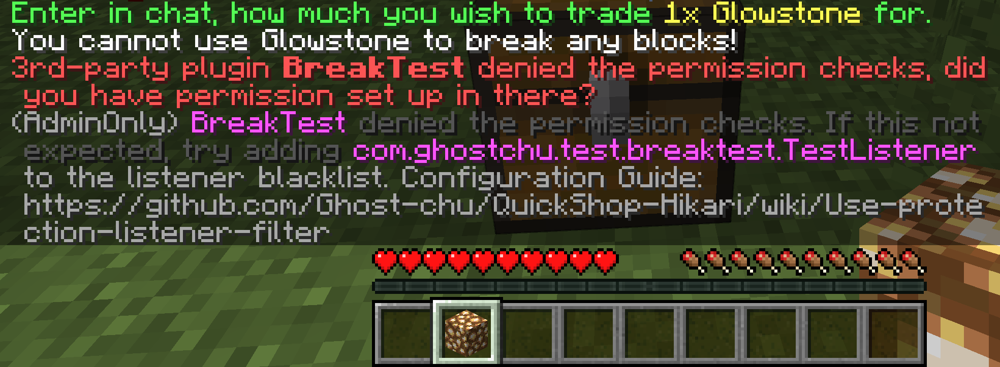

# Protection Checker

QuickShop use a util called `Protection Checker` to prevent players create shops at their had no build access positions (e.g Spawn).

## How does it work?

When player trying to create a shop at a location, QuickShop will create a new *fake* `BlockBreakEvent` to simulate player break blocks.  
If it is canceled by any plugin, QuickShop will refuse the shop creation.  

## Side Effects

Some plugins that imcompatitable with QuickShop will trigger the gadget in Player's hand or keeping block the shop creation.  

## Resolve the plugin conflicting

When a possible conflict detected by QuickShop and this operation triggered by Server administrator, the administrator will receive a message like the image below:



You can retrieve those infomations from the tips:

* PluginName (`BreakTest`)
* Plugin Listener Class Name (`com.ghsotchu.test.breaktest.TestListener`)

To resolve the conflicting, you need configure the ignore list:

```yaml
shop:
  #The listener list to skip when protection-checking.
  #Examples:
  #- xx.xxx.xxx.xxxxx.BlockBreakListenerClass
  #  This will skip calling the xx.xxx.xxx.xxxxx.BlockBreakListenerClass listener.
  #
  #- xx.xx.xxx.xxxxx
  #  This will skip calling all listener that class name start with xx.xx.xxx.xxxxx.
  #
  #- @PluginName
  #  This will skip calling all listeners registered by this plugin.
  #
  #- REGEX
  #  It also supports regex.
  protection-checking-listener-blacklist:
    - ignored_listener
```

You can use plugin name to block whole plugin to avoid that plugin receive our simulation events:

```yaml
shop:
  protection-checking-listener-blacklist:
    - "@BreakTest"
```

Or only block a listener to prevent target listener catch our simulation events:

```yaml
shop:
  protection-checking-listener-blacklist:
    - "com.ghsotchu.test.breaktest.TestListener"
```

## Disable Protection Checker

:::caution

We're extremely NOT-RECOMMEND you disable protection checker, bad players can use QuickShop to lock other player's chests even in Residence, Land, Island, WorldGuard Region, Town, Plot even your SpawnPoint!

:::  

To disable protection checker, you can simple turn off the option in config.yml:

```yaml
shop:
  #Protection check
  #This will send a FAKE BlockBreakEvent to check if you can break a block.
  #This may conflict with some protection plugins!
  #Integration checking will be checked after this, so disable it when it's conflicting with integration
  #If you don't want this, then please disable it and use the integration below instead.
  protection-checking: true
```

Or only disable in specific worlds:

```yaml
shop:
  #The list of worlds in which protection checking is disabled.
  protection-checking-blacklist:
    - disabled_world
```