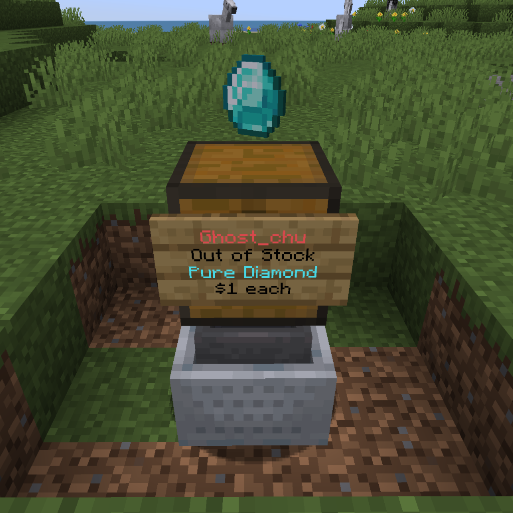

# Shop Protection

## Player Protection

By default, players that don't have permission or not the owner cannot remove another player's shop.  
And they also cannot open the shop container, put in items or take out items.

But for some reason, you don't want QuickShop handle shop protection, you can disable by tweak config settings to disable it like below:

```yaml
  #Should QS try to lock shops for other players?
  #This prevents players from stealing from them.
  lock: false
```

## Entity, Block, Explosion and Hopper protection

By default, QuickShop will protect shop container and shop sign from entity, block, explode breaks or hopper I/O.  

| Block                                        | Entity                                         | Explode                                          | Hopper <br />(include Hopper Minecart)                |
| -------------------------------------------- | ---------------------------------------------- | ------------------------------------------------ | ---------------------------------------------- |
|  |  |  |  |

You can toggle the protections above by tweak settings:

```yaml
#The protection that a shop should check.
protect:
  explode: true
  hopper: true
  # Should we allow shop owner placed hoppers?
  hopper-owner-exclude: false
  entity: true
```