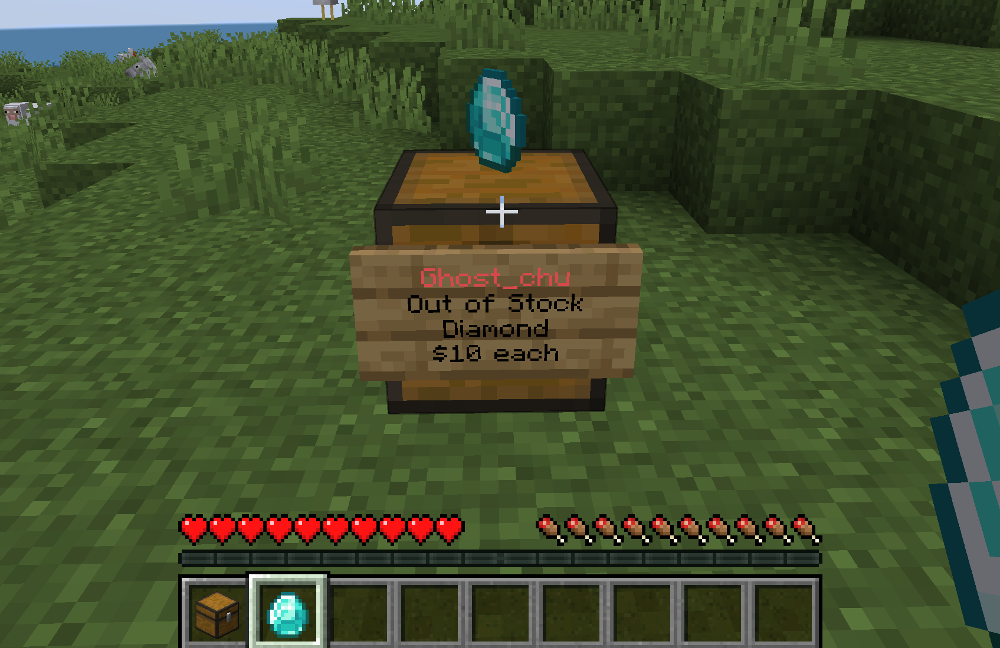
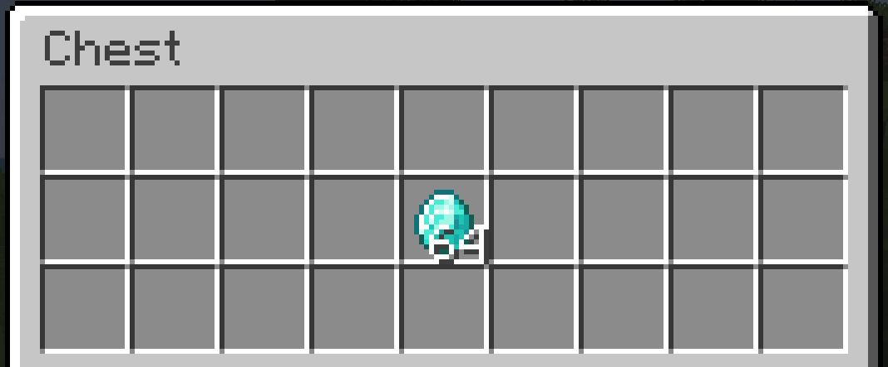
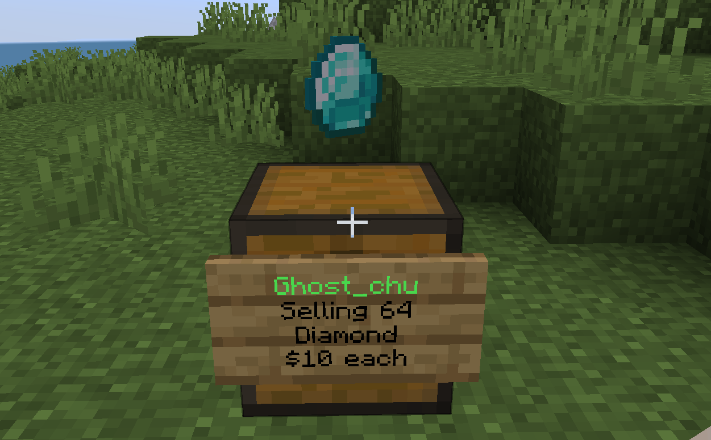
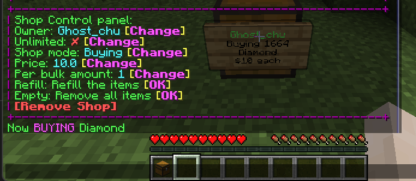

# Create and purchase

This page of document will help you learn how to create and purchase a quickshop.

## Create a selling shop

First of all, you need to put a shop container (e.g Chest), and under **Survival mode**, **left click** the container, QuickShop will ask you for the price.  
Type `10` for price in chat, you will created a shop that selling items for 10$.  

| Ask for price, enter in chat      | Shop Created                          |
| --------------------------------- | ------------------------------------- |
|  |  |

Once you setup a quickshop, anyone can left click your shop and purchase with it. 

## Fill the stock

To fill your shop stock, just simple put your items into shop container, and your shop now refilled!

| Put item into container       | Shop Refilled                 |
| ----------------------------- | ----------------------------- |
|  |  |

## Turn a shop to buying mode

Right-click the shop info sign, a control panel will pop up at your chat.  
Click `Shop Mode: Selling [Change]` button, then your shop now is a buying shop!

| Click the `[Change]` button                      | Shop Buying now                      |
| ------------------------------------------------ | ------------------------------------ |
|  |  |

## Empty the space

Same as Fill the stock, just take items out of shop container, then space will released.

## Name your shop

You can name your shop for identify, the name will shown instead of location in logs and transactions.

Looking at a quickshop, execute command `/quickshop name <name>` and you will name your quickshop.

## Change the shop price

You can change your shop price after shop created by using Control Panel.

Looking at a quickshop, then click the `Price: xx [Change]` button, and enter new price in the chat.  

## Remove your shop

To remove your quickshop, you can simple break the shop container, or use Control Panel.

## Preview the item

To avoid bad player to scam the purchasers, QuickShop allow you to preview the items that shop actually selling/buying.

Click the shop, trade panel will pop up, hover your mouse cursor on `[Preview Item]`, the item name and lores will shown up.

You can click `[Preview Item]` to open a GUI to showcase the items.  

