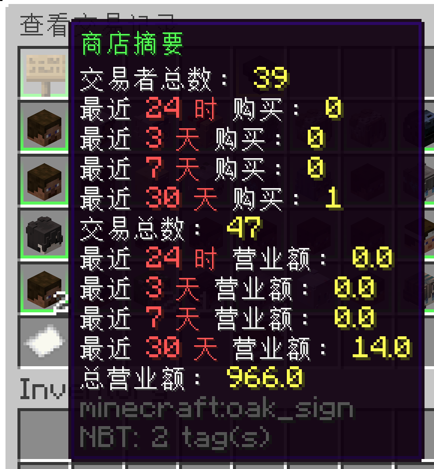
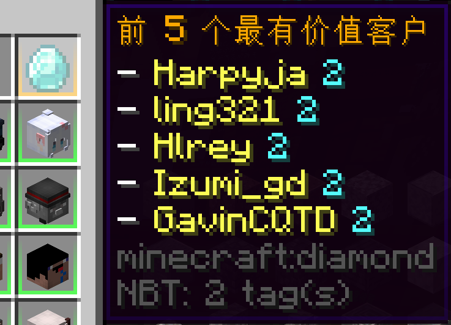

# Shop History

:::info

This feature added in 6.0.0.0.

:::

:::info

This wiki images may use non-English locale.

:::

The ShopHistory panel provides access to the transaction history of a given store.

Hover on specific player head will show currency transaction information, including:

* Transaction time
* Trader (Purchaser)
* Item and amount
* Balance
* Taxes

On the top of left, hover on the sign item, will showcase this shop purchases count, unique purchasers and turn overs.

On the top of right, hover on the diamond item, will showcase this shop most valuable customers (cap to 5).

