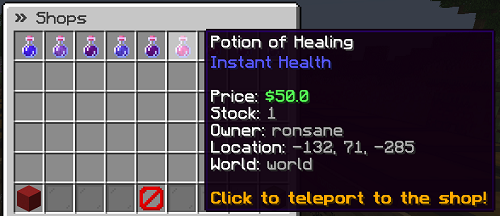

# Shop Search

QuickShop have a built-in shop searcher will allow you search the shops on your server without load any chunks.  

## Usage

Execute command `/qs find <itemname>`.

## Item name

Currently it only supports English name, we not support i18n name yet!

## Thrid party addon

There have a addon [[QuickShop Addon] Shop Search by Ronsane](https://www.spigotmc.org/resources/95104/) available on SpigotMC, you can use this addon for advanced shop searching.

