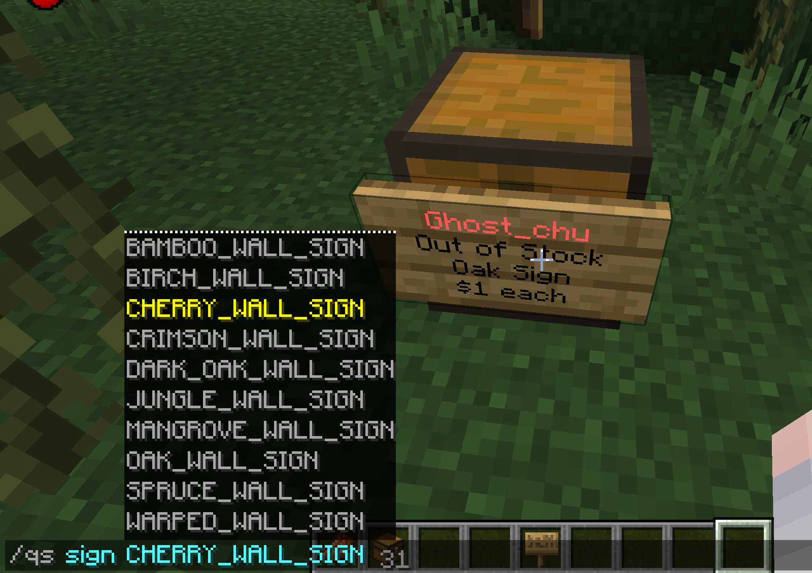
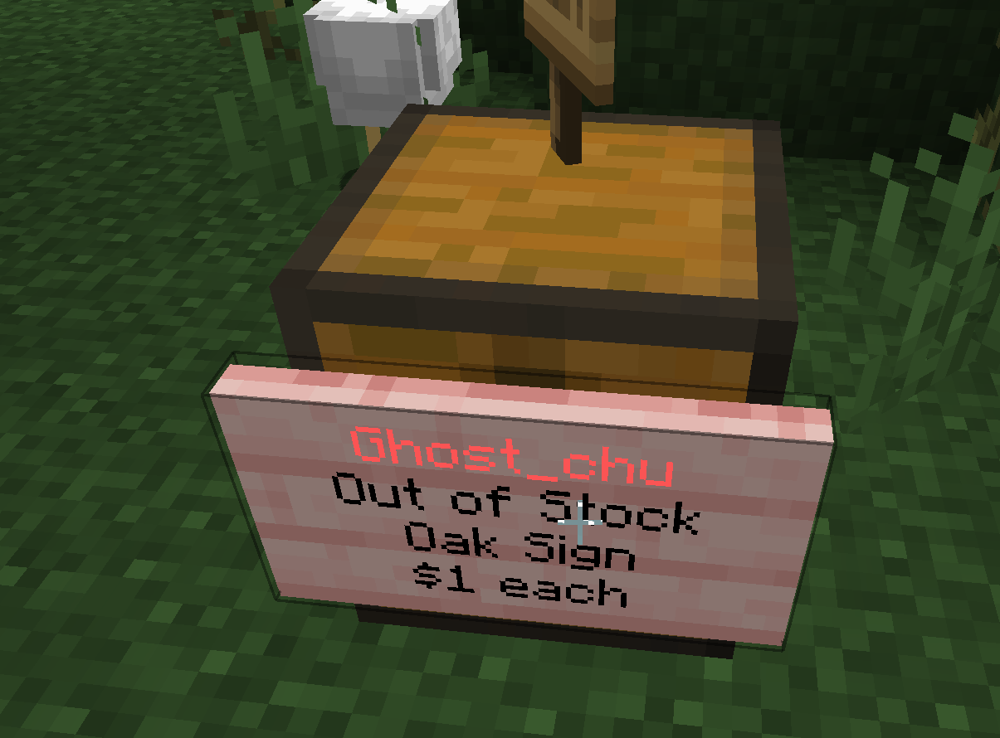

# Sign Material

:::info

This feature added in 6.0.0.0.

:::

By default, QuickShop-Hikari uses the default brand material from the configuration file, but you can modify it to other brands for your store with the command.

## Change the material

Use command `/quickshop sign <material>` to change your shop sign material.

| Before                                | After                               |
| ------------------------------------- | ----------------------------------- |
|  |  |