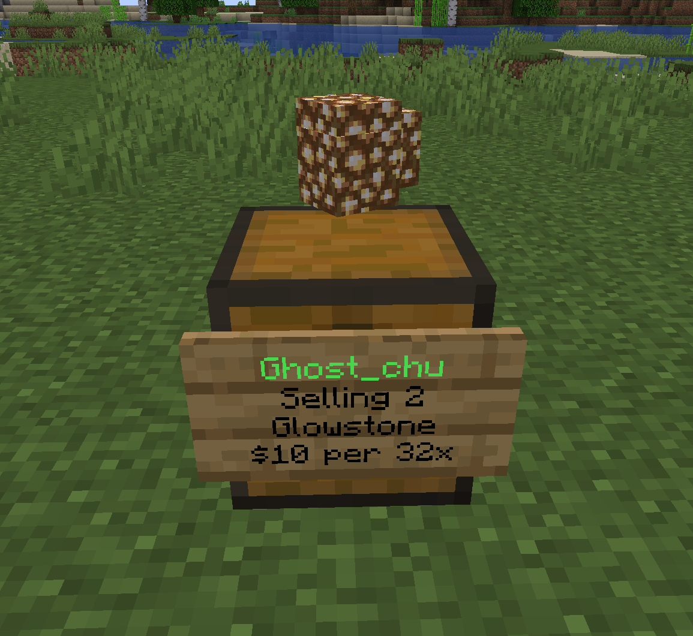
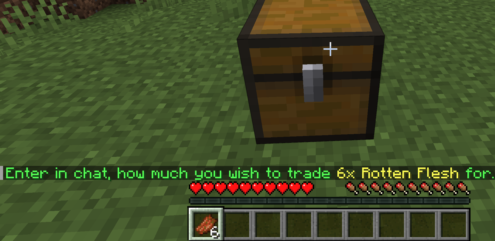

# Stacking Shop

QuickShop allow you sell/buy multiple item in bundles.

## Stacking shop

| Regular Shop                     | Stacking Shop                 |
| -------------------------------- | ----------------------------- |
|  |  |

## Configure

Stacking shop feature is disabled by default. To enable it, you need to configure the config.yml.

```yaml
shop:
  #Allow QuickShop to sell/buy multiple items in one transaction?
  allow-stacks: true
  #Allow displays to show stack effects when stack creation is turned on.
  #It doesn't work under Virtual DisplayItem.
  display-allow-stacks: true
```

By the way, create stacking shop need an extra permission which included in `quickshop.player`, you can check it in [Permissions](../../setup/permissions.md).

## Create

To create a stacking shop, just like normal shop creation but holding multiple items in your hand like the image below:



Then enter the price and go to go.

Note: The amount of items in one stack cannot up over the Item's max stacksize due Minecraft limitation.

## Change the amount for stack

To change the amount of item in your stacking shop, use command `/qs size <newamount>`.
