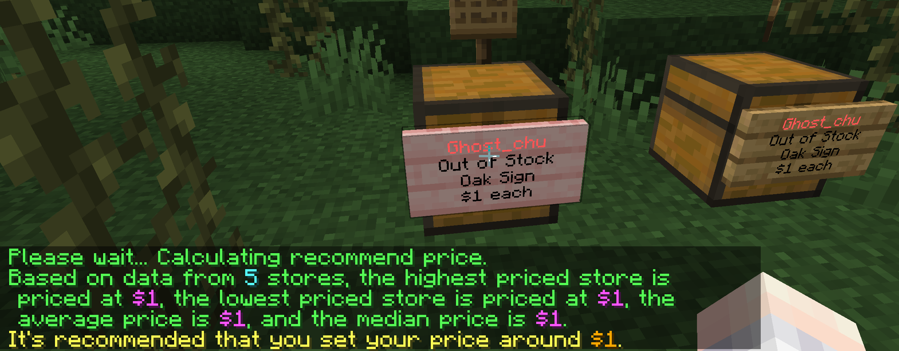

# Suggest Price

:::info

This feature added in 6.0.0.0.

:::

This feature provides your players with price suggestions for items of interest on your server by command `/quickshop suggestprice`.

To provide price suggestions, there are at least 3 participating stores on the server that must fulfill the following requirements:

* Stores requiring suggest are excluded
* Stores must have the same items
* Stores must use the same type (sell, acquire, etc.)
* Stores must use the same currency (when using a multi-currency system)
